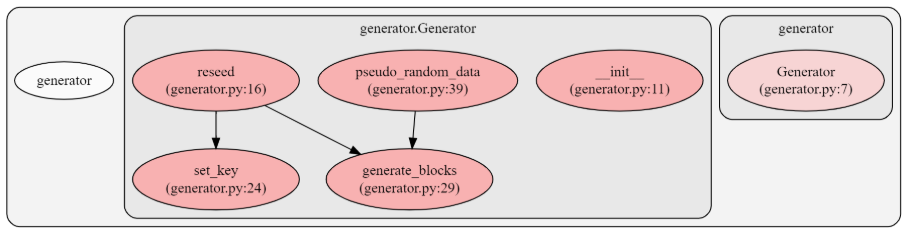

# PyFortuna
通过python实现Fortuna算法生成伪随机数

## 1. 设计思路

- 编程语言：Python

- 运行系统：Ubuntu 18.04

- 随机源

  选取Linux系统下的`/dev/random`作为随机源；

  `/dev/random`是Linux内核下的设备文件，用于记录环境噪声，常用于生成随机数

  参考：https://zh.wikipedia.org/wiki//dev/random

- 共设计四个文件，其作用如下

  1. `generator.py`，用作发生器

     包含函数如下：

     1. `reseed(seed)`，用于重新生成种子，seed为上一次生成随机数后的种子
     2. `set_key(key)`，用于生成新的密钥，kay为旧密钥
     3. `generate_blocks(n)`，分组，用于生成AES加密数据块，n为分组数目，返回16n字节的随机字符串
     4. `pseudo_random_data(n)`，用于生成随机数据，n为要生成随机数据的字节数，返回n字节随机数据

     使用`pyan && Graphviz`生成`generator.py`文件下的函数之间的调用关系如下：

     

  2. `accumulator.py`，用作累加器

     包含函数如下：

     1. `random_data(n)`，用于生成伪随机数，n表示要生成伪随机数的字节数
     2. `add_random_event(s,i,e)`，用于加入随机事件，当随机源有另外一个随机事件时，就调用此函数，s表示源编号范围，i表示赤字编号范围，e表示时间数据

     使用`pyan && Graphviz`生成`accumulator.py`文件下的函数之间的调用关系如下：

     

  3. `seedcreator.py`，用于种子文件管理，生成和更新种子文件

     包含函数如下：

     1. `seed_update(accumulator)`，用于生成和更新种子文件

     使用`pyan && Graphviz`生成`seedcreator.py`文件下的函数之间的调用关系如下：

     

  4. `main.py`，调用并整合上述三个文件，构成Fortuna伪随机数生成器

     包含函数如下：

     1. `main()`，用做输入输出接口，接收输入的生成的随机数的字节数目，调用其他函数生成并输出随机数；

- 利用 `pycallgraph`生成项目的动态调用图如下，符合设计

  

## 2. 程序运行结果

程序运行结果如下，输出随机数的字节码，每次程序调用都会重新生成种子文件，实现了Fortuna算法的随机数生成。

